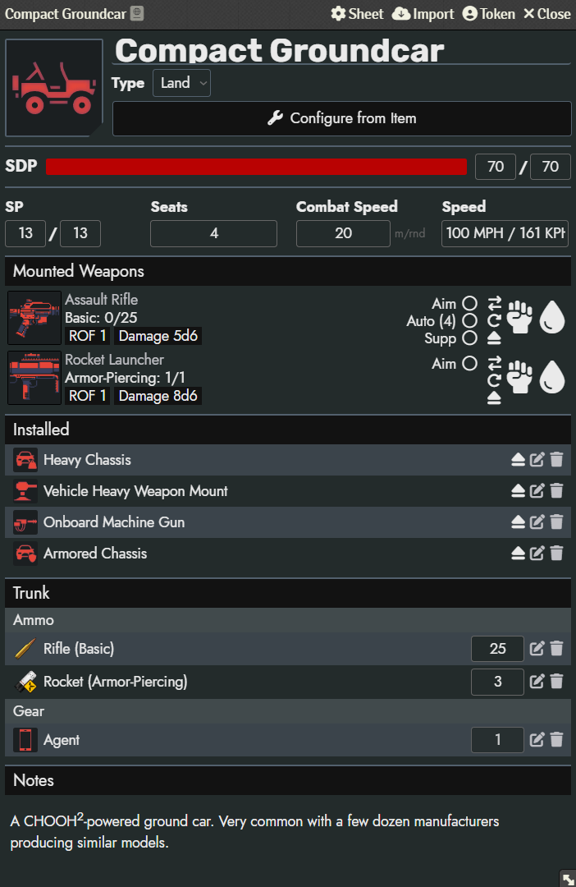

# Cyberpunk RED Vehicles

A [Foundry VTT](https://foundryvtt.com/) module for the [Cyberpunk RED Core](https://gitlab.com/cyberpunk-red-team/fvtt-cyberpunk-red-core) system that adds **vehicles as first-class actors**. Place them on the map, track structural damage via token bars, manage upgrades, mount weapons, and roll attacks/damage directly from the vehicle sheet.



## Features

- **Vehicle Actor Type** — custom actor sub-type with a dedicated data model (SDP, SP, seats, combat speed, narrative speed, vehicle type, notes).
- **Dedicated Vehicle Sheet** — purpose-built character sheet with an SDP health bar, drag-and-drop inventory, and rich-text notes.
- **Token Integration** — vehicles are created as linked tokens with SDP displayed on the token bar by default.
- **Configure from Item** — one-click dialog to copy stats (SDP, seats, speed, image, notes) from any vehicle item in your world.
- **Vehicle Upgrades** — drag vehicle upgrade items onto the sheet; modifiers are automatically applied to SDP, seats, and combat speed.
- **Vehicle Weapon Mounting** — keep weapons in trunk inventory and mount them only when compatible upgrades are installed.
- **Mounted Weapon Actions** — mook-style controls on mounted weapons: Aim, Change Ammo, Reload, Roll Attack, and Roll Damage.
- **Vehicle Combat Flow** — attack rolls use the active assigned actor (with picker fallback), while damage rolls stay vehicle-driven and ammo-aware.
- **Trunk Quantity Controls** — all trunk items show quantity; ammo is editable, non-ammo quantities are read-only.
- **Localization** — English and Polish translations included.

## Installation

### Via Foundry Module Browser

Search for **Cyberpunk RED Vehicles** in the Foundry VTT module browser (Settings > Add-on Modules > Install Module).

### Manual Install

Paste the following manifest URL into the **Install Module** dialog:

```
https://github.com/sudo-sein/cyberpunk-red-vehicles/releases/latest/download/module.json
```

## Requirements

- Foundry VTT v12
- [Cyberpunk RED - CORE](https://gitlab.com/cyberpunk-red-team/fvtt-cyberpunk-red-core) system (v0.92.0+)

## Usage

1. Enable the module in your world (Settings > Manage Modules).
2. Create a new actor and select the **Vehicle** type.
3. Fill in the vehicle stats manually, or click **Configure from Item** to copy stats from a vehicle item in your world.
4. Drag vehicle upgrade items onto the sheet to apply modifiers.
5. Drag weapons and ammo into trunk inventory, then mount eligible weapons in the **Mounted Weapons** section.
6. Use mounted weapon controls to switch fire modes, manage ammo, and roll attack/damage.
7. Place the vehicle token on a scene — SDP is shown on the token bar.

## License

This module is licensed under the [MIT License](LICENSE).
